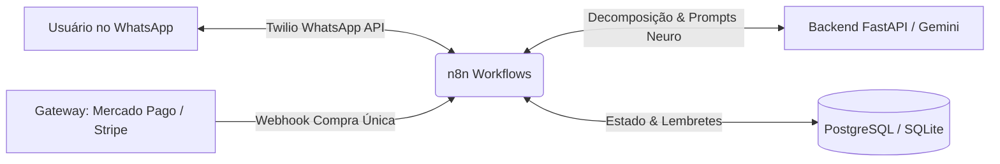

# 🧠 FocoGentil - Copiloto de Produtividade Neurodivergente

> **Copiloto conversacional via WhatsApp (Twilio + n8n) projetado para cérebros com TDAH, Autismo e Disfunção Executiva.**
> Decompõe demandas complexas em micropassos de 2 a 15 minutos, combate a paralisia por análise e agenda lembretes gentis sem culpa.
> **Modelo de Negócio:** Pagamento único (Lifetime Access) sem mensalidade ou vínculo recorrente.

---

## 🌟 Pilares Neurodivergentes do Sistema

1. **Passo de Ignição (Fricção Zero):**
   - O primeiro passo leva **menos de 3 a 5 minutos** (ex: *"Apenas abra o documento e escreva o título"*). Isso quebra a inércia da função executiva.
2. **Teoria das Colheres (Nível de Energia):**
   - Respeita o nível de bateria do usuário (Baixa, Média, Alta). Em dias de esgotamento, oferece apenas tarefas passivas ou o menor passo possível.
3. **Lembretes Livres de Culpa (*Shame-Free*):**
   - Se o usuário não concluiu uma etapa, o copiloto não cobra nem gera ansiedade. Oferece opções acolhedoras:
     - `1` - ✅ Concluiu! (celebração da micro-vitória)
     - `2` - 🤏 Ficou difícil? Fatiamos em algo menor ainda.
     - `3` - ⏸️ Pausa de 30 minutos sem estresse.
4. **Proteção de Horário de Silêncio:**
   - Nenhum lembrete é agendado durante a madrugada (22h às 08h), protegendo o sono e a regulação emocional.

---

## 💎 Modelo de Pagamento Único (Sem Vínculo Contínuo)

- **Sem Assinaturas ou Mensalidades:** Uma vez confirmado o pagamento avulso (via PIX no Mercado Pago, Cartão ou Stripe), a licença é marcada como `is_lifetime_active = true` e `has_recurring_subscription = false`.
- **Ativação Automática via Webhook:**
  1. O cliente realiza a compra única no checkout informando seu número de WhatsApp.
  2. O gateway notifica o n8n (`/webhook/payment-approved-webhook`).
  3. O n8n valida que a transação **não é recorrente** e ativa o número no banco.
  4. O usuário recebe imediatamente uma mensagem de boas-vindas no WhatsApp liberando o uso vitalício.
- **Proteção de Acesso:** Usuários não cadastrados que enviarem mensagens recebem um convite gentil explicando o modelo de pagamento único com o link de checkout.

---

## 🏗️ Arquitetura da Solução



---

## 📂 Estrutura de Arquivos

```
neuro-copilot/
├── backend/
│   ├── main.py                  # API FastAPI (Twilio, Webhooks, Lembretes)
│   ├── models.py                # Esquemas Pydantic de dados e validações
│   ├── Dockerfile               # Imagem Docker do backend
│   ├── requirements.txt         # Dependências Python
│   ├── prompts/
│   │   └── neuro_prompts.py     # Engenharia de prompts neurodivergentes
│   └── services/
│       ├── decomposition.py     # Motor de fatiamento e ignição (Gemini)
│       ├── scheduler.py         # Agendador de lembretes livres de culpa
│       ├── license_manager.py   # Gerenciador da licença de pagamento único
│       └── twilio_client.py     # Cliente e gerador de respostas TwiML
├── n8n/
│   ├── workflow_whatsapp_inbound.json   # Fluxo n8n de mensagens do WhatsApp
│   ├── workflow_reminders_cron.json     # Fluxo n8n do cron de lembretes
│   └── workflow_payment_webhook.json    # Fluxo n8n de ativação de compra única
├── tests/
│   └── test_copilot.py          # Testes unitários e de integração
├── docker-compose.yml           # Orquestração (n8n + Backend + Postgres)
├── .env.example                 # Modelo de variáveis de ambiente
└── README.md                    # Documentação do projeto
```

---

## 🚀 Como Executar

### 1. Pré-requisitos
- Docker e Docker Compose instalados (ou Python 3.10+ local).
- Conta no [Twilio](https://www.twilio.com/) com WhatsApp Sandbox ativado.
- Chave de API do [Google AI Studio](https://aistudio.google.com/) (Gemini) para a IA.

### 2. Configuração de Variáveis
Copie o arquivo `.env.example` para `.env`:
```bash
cp .env.example .env
```
Preencha as variáveis com suas credenciais:
- `GEMINI_API_KEY`
- `TWILIO_ACCOUNT_SID`
- `TWILIO_AUTH_TOKEN`
- `TWILIO_WHATSAPP_NUMBER`

### 3. Subindo a Stack com Docker Compose
```bash
docker-compose up -d
```
Serviços iniciados:
- **FastAPI Backend:** `http://localhost:8000`
- **n8n Workflow Engine:** `http://localhost:5678`
- **PostgreSQL:** `localhost:5432`

---

## 📲 Configuração do Twilio e n8n

### 1. Importando os Workflows no n8n:
1. Acesse `http://localhost:5678` no seu navegador.
2. Vá em **Workflows** > **Import from File...**
3. Importe os 3 arquivos da pasta `n8n/`:
   - `workflow_whatsapp_inbound.json`
   - `workflow_reminders_cron.json`
   - `workflow_payment_webhook.json`
4. Clique em **Publish/Active** em cada workflow.

### 2. Configurando o Webhook no Twilio WhatsApp Sandbox:
1. No console da Twilio, vá para **Messaging** > **Try it out** > **Send a WhatsApp message**.
2. Na aba **Sandbox Settings**, localize o campo **WHEN A MESSAGE COMES IN**.
3. Configure como `POST` apontando para a URL pública do seu n8n:
   `https://seu-dominio.com/webhook/twilio-whatsapp-inbound`
   *(Em ambiente de desenvolvimento local, utilize Ngrok, Cloudflare Tunnel ou Localtunnel).*

### 3. Configurando o Webhook de Pagamento Único:
No Mercado Pago ou Stripe, configure o endpoint de notificação:
- URL: `https://seu-dominio.com/webhook/payment-approved-webhook`
- Eventos: `payment.created` / `payment.updated` (Mercado Pago) ou `checkout.session.completed` (Stripe).

---

## 🧪 Rodando os Testes Unitários

Para validar os algoritmos de fatiamento de tarefas, respeito ao sono e licenciamento:
```bash
pytest tests/test_copilot.py -v
```
